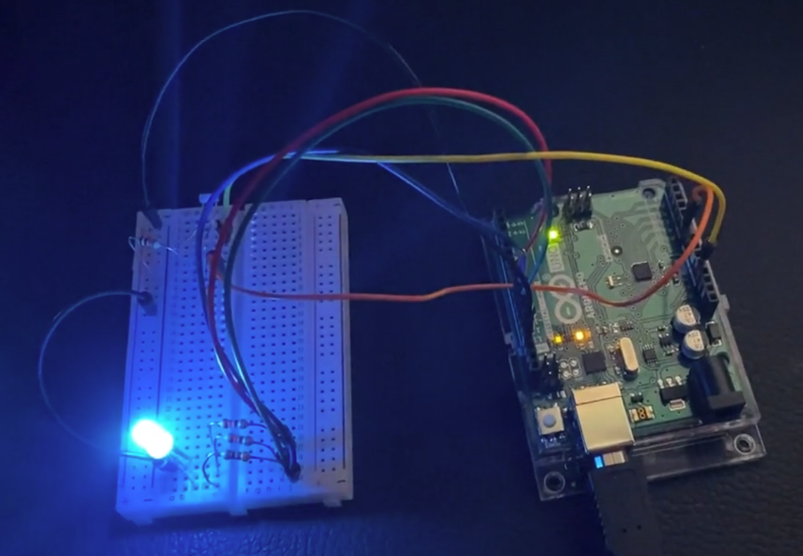

This project uses an Arduino Uno, an RGB LED, and a photoresistor to create a nightlight that moves through a spectrum of colors.

On startup, the photoresistor detects the ambient light in the room, and when the light is turned off, it will activate the light. To reset the value for ambient light in a room, restart the script with the reset button on the arduino. 

This project requires the following:
* Arduino Uno and cable
* Breadboard (optional)
* 5 male/male wires
* 3 330 Ohm resistors
* 1 10 kOhm resistor
* Photoresistor
* Common-cathode RGB LED light

To configure, the longest leg of the common cathode LED should be connected to ground, and the other three connectors correspond to red/blue/green and should be connected (each through a 330 Ohm resistor) to a separate PWM port on the Uno (these ports also need to be entered in the global variables at the start of the code- curently set up so red/blue/green connect to ports 9/10/11, respectively). The photoresistor should be connected such that current flows from the 5V port to the photoresistor, and then splits with one branch returning to an Arduino analog read port (configured as A0 currently), and the other flows through a 10 kOhm resistor to ground. 

[Example video](https://imgur.com/a/4vAF4wJ)

