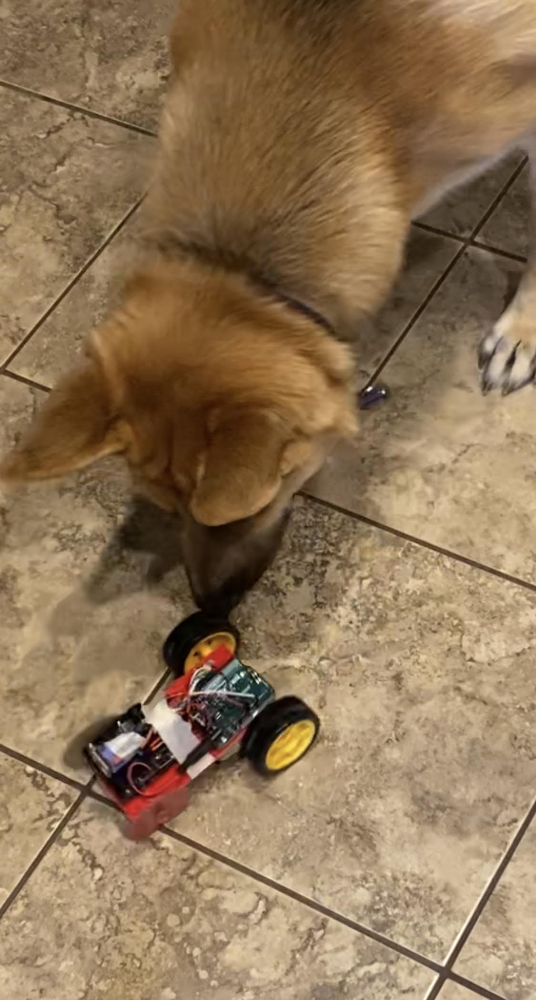

This project uses an Arduino Uno, motors, and an H-bridge to create a small, driveable robot.

This project requires the following:
* Arduino Uno and cables
* 2 x 48:1 gearbox DC motors (Model DG01D)
* 2 x rubber wheels fit for the DC motors
* TB6612AFNG H-Bridge motor driver breakout board
* button (optional)
* 10 kOhm resistor (for the button, optional)
* Battery pack (required if you want your bot to roam free)
* wires, cardboard, and electrical tape

# Circuits/Connections:
## Motors
The motors are connected to the H-Bridge breakout board- the red wires on each motor are A01/B01 and the black wires are connected to A02/B02 (the motors face outboard with the additional metal shaft pointing aft, and the left and right motors are connected to the "A" and "B" pins, respectively). This isn't critical, but changing it around may result in one or both motors driving backwards- to reverse it simply switch the fourth argument for the motor initialization (lines 10/11), which controls whether the motor direction is reversed.

In addition to common power and ground pins on the H bridge (the STBY pin also needs to be connected to the 5V pin to activate the motors), there are six connections required: three per motor. Each motor has a pin 1/2 and a PWM pin. The PWM pin controls each motor's speed (and must be connected to a PWM port on the Arduino), and whether the 1/2 pins are set to high or low voltage controls the motor's direction and braking action (see table below).

| Motor Movement | Pin 1 State | Pin 2 State |
| --- | --- | --- |
| Clockwise | HIGH | LOW |
| Counterclockwise | LOW | HIGH |
| Hard Brake | HIGH | HIGH |
| Coast | LOW | LOW |

For more information, see The Arduino Inventor's Guide, project 8.

## Button
The button is optional, but I added one with a pull-down 10 kOhm resistor to trigger the robot to start its preprogrammed sequence (rather than starting it as soon as power is applied and infinitely repeating it). See [this link](https://www.arduino.cc/en/Tutorial/BuiltInExamples/Button) for details on how to implement it.

# Building the Bot
I opted to go for a smaller bot, with just enough surface area to hold the Arduino and battery pack. The robot pictured below is just cardboard and electrical/masking tape. The rear wheels leave room for creativity- I just made rear wheels with cardboard to keep the weight down.

[Video example (dog for scale)!](https://imgur.com/a/zVcp5YW)

